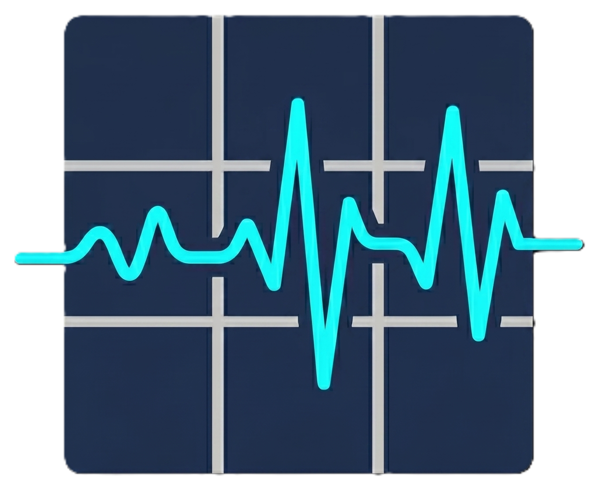
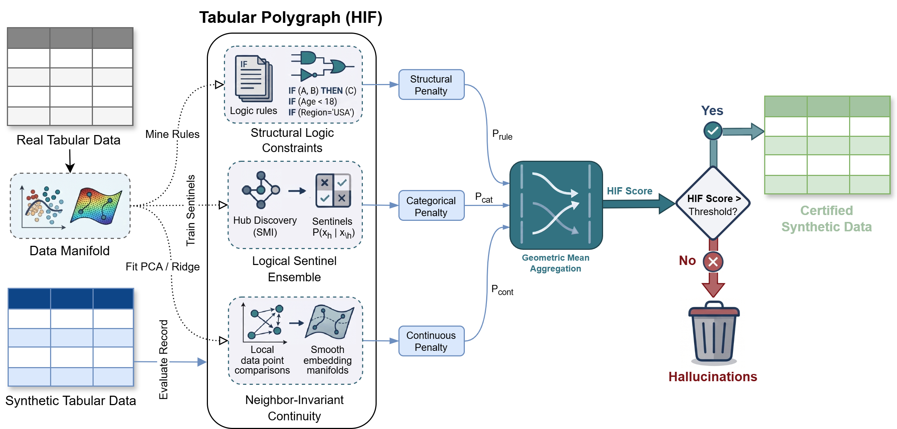

# The Tabular Polygraph: Neurosymbolic Hallucination Detection in Synthetic Data

<div align="center">



[](https://github.com/ahmed-fouad-lagha/tabular-polygraph/actions/workflows/ci.yml)
[](requirements.txt)
[](https://pytorch.org)
[](LICENSE)

**A Neuro-Symbolic Hybrid Integrity Framework for logically-consistent synthetic tabular data.**

---

</div>

The Hybrid Integrity Framework (HIF) provides a technically rigorous foundation for evaluating synthetic tabular data quality beyond simple distributional similarity. Standard evaluation pipelines measure Euclidean and marginal agreement, which can miss row-level semantic inconsistencies — incompatible categorical combinations, physically implausible numeric relations, or violated domain constraints. HIF addresses this gap through neurosymbolic learning and acts as a Tabular Polygraph to detect "Semantic Hallucinations".

<p align="center">
	
	<br>
	<em>Figure 1: The HIF Hybrid Integrity Framework</em>
</p>

The HIF Hybrid Integrity Framework provides:
- **Algebraic Integrity Certificates** via the Multiplicative Integrity (MI) model.
- **Neural-Symbolic Oracles (LSE)** for categorical manifold discovery and auditing.
- **Neighbor-Invariant Continuity (NIC)** for verifying continuous manifold residuals.
- Reporting alongside marginal, joint, stylized-facts, downstream, and TAMIS privacy metrics.

#### Core workflow
1. Learn structural regularities from real data using an unsupervised model
2. Score each synthetic row by semantic deviation severity
3. Aggregate violations into dataset-level quality diagnostics

#### Performance
- **Spearman Monotonicity (rho = -1.0)**: Perfect sensitivity to semantic corruption levels on the ACS Census dataset.
- **Utility Correlation (> 0.87)**: High alignment between HIF integrity scores and downstream predictive accuracy.
- **Hallucination Detection**: Identifies row-level 'Logical Consistency Gaps' missed by standard KS and TVD metrics.

## Setup

```bash
git clone https://github.com/ahmed-fouad-lagha/tabular-polygraph.git
cd tabular-polygraph
pip install -r requirements.txt

# Verify environment 
python main.py list
```

## Quick Start

Evaluate synthetic data against real ground truth. The evaluate command generates a 4-Pillar Scorecard covering Fidelity, Logic (Integrity), Utility, and Privacy. 

```bash
# 1. Download sample data (cached in ~/.src/cache/)  
python main.py download census_acs

# 2. Generate synthetic data using a Gaussian Copula   
python main.py generate census_acs --rows 100 --output synthetic.csv

# 3. Audit for Hallucinations (Semantic Integrity)
python main.py evaluate ~/.src/cache/census_acs.parquet synthetic.csv --type cross_sectional --hif-epochs 10
```

## Python API                            

```python
import pandas as pd
from src.catalog import load_dataset
from src.fidelity import fidelity_report
from src.fidelity.logical import hif_score

# 1. Load Data
real = load_dataset("census_acs")
syn = pd.read_csv("synthetic.csv")

# 2. Generate 4-Pillar Scorecard (Stats, Logic, Utility, Privacy)
report = fidelity_report(real, syn, dataset_type="cross_sectional")
print(f"Hybrid Integrity Score: {report['summary']['hybrid_integrity']}%")

# 3. Detect Row-Level Hallucinations
# hif_score returns per-row penalty scores [0 = valid, 1 = hallucination]
hif_results = hif_score(real, syn)
syn['hallucination_score'] = hif_results['row_penalties']

# Identify the top Hallucinations
hallucinations = syn.sort_values('hallucination_score', ascending=False).head(5)
print(hallucinations)
```

## License

MIT — see [LICENSE](LICENSE).
