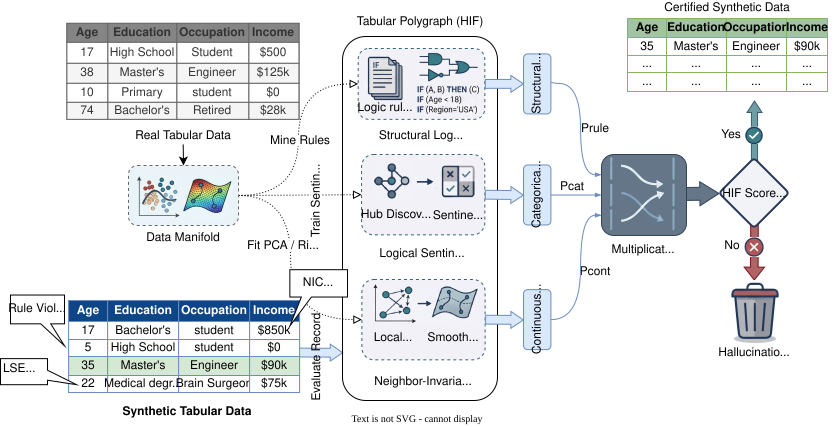

# Beyond Fidelity: When Statistical Quality Metrics Miss Structural Violations in Synthetic Tabular Data

<div align="center">


[](https://github.com/ahmed-fouad-lagha/tabular-polygraph/actions/workflows/ci.yml)
[](requirements.txt)
[](https://pytorch.org)
[](LICENSE)

**A Neuro-Symbolic Hybrid Integrity Framework for logically-consistent synthetic tabular data.**

---

</div>

The Hybrid Integrity Framework (HIF) provides a technically rigorous foundation for evaluating synthetic tabular data quality beyond simple distributional similarity. Standard evaluation pipelines measure Euclidean and marginal agreement, which can miss row-level semantic inconsistencies — incompatible categorical combinations, physically implausible numeric relations, or violated domain constraints. HIF addresses this gap through neurosymbolic learning and acts as a Tabular Polygraph to detect "Semantic Hallucinations".

<p align="center">
	
	<br>
	<em>Figure 1: The Hybrid Integrity Framework (HIF)</em>
</p>

The HIF Hybrid Integrity Framework provides:
- **Algebraic Integrity Certificates** via the Multiplicative Integrity (MI) model.
- **Neural-Symbolic Oracles (LSE)** for categorical manifold discovery and auditing.
- **Neighbor-Invariant Continuity (NIC)** for verifying continuous manifold residuals.
- Reporting alongside marginal, joint, stylized-facts, and downstream utility metrics.

#### Core workflow
1. Learn structural regularities from real data using an unsupervised model
2. Score each synthetic row by semantic deviation severity
3. Aggregate violations into dataset-level quality diagnostics

#### Performance
- **Spearman Monotonicity ($\rho = -1.0$)**: Perfect monotonic response under targeted semantic corruption in both current Census and Adult validation runs.
- **Utility Correlation is dataset-dependent**: Strong on Census ACS in current runs, weak on Adult under the same protocol.
- **Hallucination Detection**: Identifies row-level logical consistency gaps that can be attenuated by aggregate KS/TVD-style summaries.

## Setup

```bash
git clone https://github.com/ahmed-fouad-lagha/tabular-polygraph.git
cd tabular-polygraph
pip install -e .

# Verify environment
tabular-polygraph list
```

## Quick Start

Evaluate synthetic data against real ground truth. The evaluate command generates a 4-Pillar Scorecard covering Fidelity, Logic (Integrity), Utility, and Privacy.
```bash
# 1. Download sample data (cached in ~/.tabular_polygraph/cache/)
tabular-polygraph download census_acs

# 2. Generate synthetic data
tabular-polygraph generate census_acs --rows 100 --output synthetic.csv

# 3. Audit for Hallucinations (Semantic Integrity)
tabular-polygraph evaluate ~/.tabular_polygraph/cache/census_acs.parquet synthetic.csv --type cross_sectional --hif-epochs 10
```

## CLI Reference

### Generate Synthetic Data

```bash
tabular-polygraph generate <dataset_id_or_path> \
  --rows <number_of_rows> \
  --generator <type> \
  --seed <integer> \
  --output <filename.csv>
```

### Audit Synthetic Data (Fidelity Report)

```bash
tabular-polygraph evaluate <real_data_path> <synthetic_data_path> \
  --type <cross_sectional|time_series|panel> \
  --hif-epochs <integer> \
  --seed <integer> \
  --target <target_column_for_utility> \
  --output <report.json>
```

## Python API

```python
import pandas as pd
from tabular_polygraph import hif_score  # one-liner row-level audit
from tabular_polygraph.dataset import load_dataset
from tabular_polygraph.fidelity import fidelity_report

# 1. Load Data
real = load_dataset("census_acs")
syn = pd.read_csv("synthetic.csv")

# 2. Generate 4-Pillar Scorecard (Stats, Logic, Utility, Privacy)
report = fidelity_report(real, syn, dataset_type="cross_sectional")
print(f"Hybrid Integrity Score: {report['summary']['hybrid_integrity']}%")

# 3. Detect Row-Level Hallucinations
# hif_score returns per-row penalty scores [0 = valid, 1 = hallucination]
hif_results = hif_score(real, syn)
syn["hallucination_score"] = hif_results["row_penalties"]

# Identify the top Hallucinations
hallucinations = syn.sort_values("hallucination_score", ascending=False).head(5)
print(hallucinations)
```

## Reproduce Benchmarks

The empirical results and tables in the manuscript are produced by the scripts in `scripts/`, which write to `outputs/` by default. Each section below maps a manuscript result to its reproducing command.

### 1. HIF Validation & Calibration (Section 4.4)
Sensitivity of HIF to semantic corruption under `permutation` and `conditional_swap` corruption strategies, and the associated calibration curves.

```bash
python scripts/02_hif_calibration.py --dataset census_acs --rows 2000 --seeds 3 \
  --levels 0,0.1,0.2,0.4,0.6 --strategy permutation --generator ctgan

python scripts/02_hif_calibration.py --dataset census_acs --rows 2000 --seeds 3 \
  --levels 0,0.1,0.2,0.4,0.6 --strategy conditional_swap --generator ctgan
```

### 2. Cross-Architecture Benchmark (Table 1)
Scores Gaussian Copula, Vine Copula, CTGAN, and T-VAE cohorts on the Census ACS demographic manifold across fidelity and utility metrics, including a real-data ground-truth baseline.

```bash
python scripts/03_cross_architecture_benchmark.py --rows 2000 --seeds 10 \
  --generators gaussian_copula,vine,ctgan,tvae
```

### 3. Downstream Utility Filtering (Table 2)
Paired tests comparing downstream F1 under HIF filtering vs no filtering (binary median-split `household_income` target) across all dataset--generator combinations.

```bash
python scripts/04_downstream_utility_significance.py --dataset census_acs \
  --target household_income --rows 2000 --seeds 10 --generator gaussian_copula

python scripts/04_downstream_utility_significance.py --dataset census_acs \
  --target household_income --rows 2000 --seeds 10 --generator ctgan
```

### 4. Held-Out Error Benchmarks (Table 3)
Validates HIF on held-out error families HIF was not engineered to detect, comparing against Isolation Forest and LOF baselines; `05_heldout_matched_threshold.py` additionally reports HIF F1 at an operating point matched to the baselines' `contamination` setting.

```bash
python scripts/05_heldout_error_baselines.py --dataset census_acs --rows 2000 \
  --seeds 10 --corruption-levels 0.4

python scripts/05_heldout_matched_threshold.py --dataset census_acs --rows 2000 \
  --seeds 42,43,44,45,46,47,48,49,50,51 --corruption-levels 0.4
```

### 5. Component Ablation Study (Table 4)
Isolates each HIF component (LSE, NIC, rule audit) and each aggregation scheme to measure its contribution to violation detection.

```bash
python scripts/06_component_ablation_study.py --dataset census_acs \
  --target household_income --rows 2000 --seeds 5 --generator ctgan
```

### 6. Hyperparameter Sensitivity (Appendix)
Demonstrates HIF's stability across hub counts, confidence percentiles, and violation thresholds.

```bash
python scripts/07_hyperparameter_sensitivity.py --dataset census_acs --records 2000 --seeds 5
```

## License

This project is licensed under the MIT License — see [LICENSE](LICENSE) for details.
